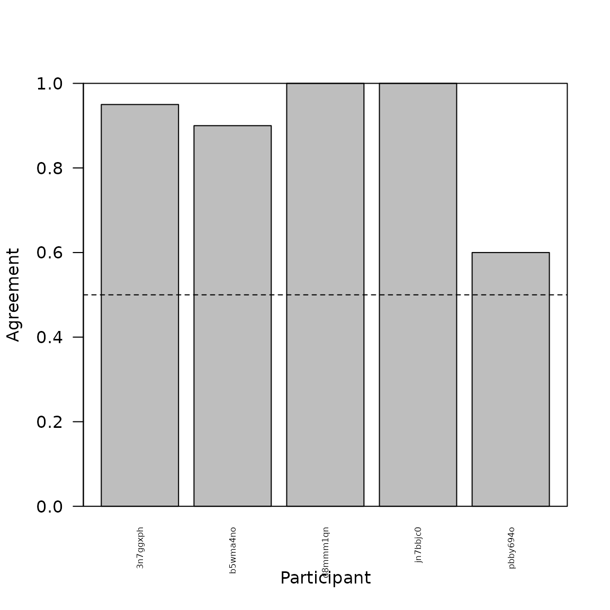

# tripletTools Overview

## Introduction

This package is designed to help analyze and visualize results from
*triadic comparisons* (or *triplet tasks*), which are used to
characterize the structure of mental representations. In a triplet task,
a participant sees a *referent* item and two *option* items, and must
decide which option is most similar to the referent. From many such
judgments across many items and participants, one can compute a
*similarity embedding*: a low-dimensional coordinate space in which
items that are frequently judged as similar are placed nearby.

`tripletTools` does not collect data or compute embeddings — those steps
occur outside R. Instead it provides tools for:

- Loading triplet and embedding data files
- Assessing participant data quality
- Measuring inter-subject agreement on shared trials
- Visualizing embeddings
- Evaluating how well an embedding predicts held-out judgments
- Quantifying individual differences in representation
- Clustering participants by representational similarity

This vignette illustrates each of these steps using the example dataset
included with the package.

``` r

library(tripletTools)
```

------------------------------------------------------------------------

## The example dataset

The package includes objects from a triplet study on 32 icon images of
faces and buildings. The icons varied in category (face/building), time
of day (day/night), and additional features (gender and race for faces;
size and kind for buildings). Five participants each judged
approximately 230 triplets online.

| Object | Description |
|----|----|
| `icon_triplets` | Named list of 5 data frames, one per participant, containing trial-by-trial judgments |
| `icon_emb_ind` | Named list of 5 matrices, one per participant, containing 3-D embedding coordinates |
| `icon_emb_group` | Single data frame containing a 3-D group embedding |
| `icon_pics` | Named list of 32 PNG images, one per stimulus icon |

### Triplet data

Each element of `icon_triplets` is one participant’s trial data:

``` r

head(icon_triplets[[1]])
#>   X head winner loser worker_id   rt Center  Left Right Answer  sampleAlg
#> 1 1   29     24    19  3n7ggxph 3096  pnhns pncnb pdcos  pncnb     random
#> 2 2   14      0    24  3n7ggxph 1100  fnmyb fdfob pncnb  fdfob     random
#> 3 3   30     19    24  3n7ggxph 2616  pnhob pncnb pdcos  pdcos     random
#> 4 4   17     12    13  3n7ggxph 2629  pdcns fnmow fnmob  fnmob validation
#> 5 5   29      9     8  3n7ggxph 2011  pnhns fnfow fnfob  fnfow     random
#> 6 6   25     23    12  3n7ggxph 1498  pncns fnmob pdhos  pdhos     random
#>   sampleSet
#> 1     train
#> 2     train
#> 3     train
#> 4     train
#> 5     train
#> 6     train
```

The key columns are `Center` (the referent item), `Left` and `Right`
(the two options), `Answer` (the participant’s choice), `sampleAlg` (how
the trial was sampled: `random`, `check`, or `validation`), and
`sampleSet` (whether the trial was used to fit the embedding — `train` —
or held out for testing — `test`).

### Embedding data

Each element of `icon_emb_ind` is a 32-row matrix of 3-D embedding
coordinates, with row names equal to stimulus names:

``` r

head(icon_emb_ind[[1]])
#>           dim_0     dim_1      dim_2
#> fdfob 0.6411938 0.9710717 -0.9336048
#> fdfow 0.5504593 0.9558654 -0.9130039
#> fdfyb 0.2907846 0.6866032 -0.6360701
#> fdfyw 0.5820549 0.9266087 -0.8992642
#> fdmob 0.5776460 1.0081034 -0.8230091
#> fdmow 0.7911357 0.4666237 -0.4759873
```

------------------------------------------------------------------------

## Data quality assessment

Before analyzing results it is good practice to check whether
participants engaged with the task. `get.participant.summary` produces a
per-participant summary including the number of trials completed, mean
accuracy on *check trials* (easy triplets with an obvious answer used as
an attention check), and mean log response time.

``` r

psummary <- get.participant.summary(icon_triplets, mintrial = 230)
head(psummary)
#>   tripfile worker_id ndat       lrt cacc keep
#> 1 3n7ggxph  3n7ggxph  230 0.4961625    1 TRUE
#> 2 b5wma4no  b5wma4no  230 0.9026607    1 TRUE
#> 3 d8mmm1qn  d8mmm1qn  230 0.5051381    1 TRUE
#> 4 jn7bbjc0  jn7bbjc0  230 0.6958144    1 TRUE
#> 5 pbby694o  pbby694o  230 0.6679493    1 TRUE
```

The output includes a `keep` column flagging participants who fall below
the specified thresholds (the specified minimum number of trials,
check-trial accuracy ≥ 0.80, mean log RT \> 0). Participants failing
these criteria should be reviewed before including their data in
downstream analyses.

------------------------------------------------------------------------

## Inter-subject agreement on validation trials

A subset of trials — the *validation* trials — are drawn from a fixed
pool shared across all participants, meaning the same triplets appear in
multiple participants’ datasets. This allows us to measure inter-subject
consistency: for each validation triplet we identify the *majority vote*
(the option chosen by most participants who saw it) and the proportion
of participants who agreed with that majority.

`make.vmat` computes this from the full triplet list:

``` r

vmat <- make.vmat(icon_triplets)

# One row per unique validation triplet
head(vmat$majority)
#>             triplet majority pmaj
#> 1 fdfow_fnmyb_pdhos    fnmyb 1.00
#> 2 fdmob_fdfow_pnhob    fdfow 1.00
#> 3 fdmob_fdmow_fdmyb    fdmyb 0.75
#> 4 fdmob_fnmob_pdcos    fnmob 1.00
#> 5 fdmow_fdmyw_fnfyw    fdmyw 1.00
#> 6 fdmow_fnfyw_pncnb    fnfyw 1.00
```

The `pmaj` column shows the proportion of participants who agreed with
the majority choice. Values near 1.0 indicate near-universal agreement;
values near 0.5 indicate a closely split decision.

``` r

hist(vmat$majority$pmaj,
     breaks = 10,
     main   = "Inter-subject agreement on validation trials",
     xlab   = "Proportion agreeing with majority vote",
     col    = "steelblue", border = "white")
abline(v = 0.5, lty = 2, col = "red")
```


Distribution of inter-subject agreement on validation trials.

The `bysbj` element is a participant × triplet matrix recording whether
each participant agreed with the majority vote (1), disagreed (0), or
did not see the triplet (NA). The mean across triplets gives each
participant’s overall agreement rate:

``` r

barplot(rowMeans(vmat$bysbj, na.rm = TRUE), 
        beside = T, 
        ylim = c(0, 1.0),
        xlab = "Participant",
        ylab = "Agreement",
        cex.names = 0.5,
        las=2)
box()
abline(h = 0.5, lty = 2)
```



Participants can vary quite a bit as to how well they agree with the
majority vote, indicating potential individual differences in how people
view these stimuli.

------------------------------------------------------------------------

## Visualizing a 2-D embedding

`plot_pics` plots images as points in a scatterplot, positioned at their
embedding coordinates. This gives an immediate visual impression of how
the faces are organized in the learned similarity space.

``` r

emb1 <- icon_emb_ind[[1]]

plot_pics(emb1[,1:2], icon_pics,
          psize = 0.04,
          xlab  = "Dimension 1",
          ylab  = "Dimension 2",
          main  = "Embedding – participant 1")
```


3-D embedding for participant 1, with icon images as points (first two
dimensions shown).

Icons that appear close together were frequently judged as similar to
one another by this participant.

------------------------------------------------------------------------

## Evaluating embedding quality: hold-out prediction accuracy

After computing an embedding we want to know how well it captures the
participant’s actual judgments. For each held-out (*test*) triplet we
can ask: does the embedding correctly predict which option the
participant chose? The predicted choice is whichever option is closer to
the referent in the embedding space.

`get.hoacc` returns the proportion of held-out trials for which the
embedding’s prediction matches the participant’s answer:

``` r

acc1 <- get.hoacc(icon_emb_ind[[1]], icon_triplets[[1]])
cat("Hold-out prediction accuracy (participant 1):", round(acc1, 3), "\n")
#> Hold-out prediction accuracy (participant 1): 0.688
```

Chance performance is 0.50. Values above approximately 0.60 are
generally considered reasonable for a 2-D embedding.

`test.model` returns trial-level predictions, making it easy to inspect
specific errors or compute accuracy on any subset of trials:

``` r

result     <- test.model(icon_emb_ind[[1]], icon_triplets[[1]])
test_rows  <- result$sampleSet == "test"
mean(result$ModPred[test_rows] == result$Answer[test_rows], na.rm=TRUE)
#> [1] 0.6875
```

### Prediction strength

`model.strength` computes, for each triplet, how *decisively* the
embedding favors one option over the other. The metric is max(d1, d2) /
(d1 + d2), where d1 and d2 are the distances from the referent to each
option. It ranges from 0.5 (options equidistant from the referent) to
1.0 (one option far closer than the other).

If the embedding is well-calibrated, trials where it is most confident
should also be the trials where participants agree most strongly. We can
test this using the validation trials, for which we have an
inter-subject agreement measure. *NOTE*: typically one would evaluate
this for a group embedding, since validation statistics are computed
across the whole group. Here we illustrate using the individual
embedding from Participant 1; see `icon_emb_group` for the group
embedding of these stimuli:

``` r

# Validation trials for participant 1
vtrips <- subset(icon_triplets[[1]], sampleAlg == "validation")

# Prediction strength from participant 1's embedding
pstrength <- model.strength(icon_emb_ind[[1]], vtrips)

# Locate matching inter-subject agreement values
tnames  <- make.tripnames(vtrips)
maj_idx <- match(tnames, vmat$majority$triplet)
pmaj    <- vmat$majority$pmaj[maj_idx]

# Plot the relationship
plot(pstrength, pmaj,
     xlab = "Embedding prediction strength",
     ylab = "Inter-subject agreement",
     pch  = 16, col = rgb(0, 0, 0.8, 0.4),
     main = "Strength vs. inter-subject agreement")
abline(lm(pmaj ~ pstrength), col = "red")

text(.5, .96, paste("r =", round(cor(pstrength, pmaj, use = "complete.obs"), 3)), adj = 0)
```


Embedding prediction strength vs. inter-subject agreement on validation
trials.

A positive correlation indicates that the embedding correctly identifies
which triplets have clearer, more consistent answers.

------------------------------------------------------------------------

## Individual differences: the prediction matrix

A central question in many triplet studies is whether participants
differ reliably in their representations. The *prediction matrix*
approach addresses this: we use each participant’s embedding to predict
every other participant’s held-out judgments. If individual differences
are real and systematic, a participant’s *own* embedding should predict
their judgments better than another participant’s embedding does.

`get.prediction.matrix` computes this for all pairs:

``` r

pmat <- get.prediction.matrix(icon_emb_ind, icon_triplets)
```

The result is a 5 × 5 matrix. Entry \[i, j\] is the accuracy with which
participant i’s embedding predicts participant j’s held-out judgments.
The diagonal contains each participant’s *self-prediction* accuracy.

``` r

cat("Mean self-prediction accuracy:  ", round(mean(diag(pmat)), 3), "\n")
#> Mean self-prediction accuracy:   0.786
cat("Mean other-prediction accuracy: ", round(mean(pmat[row(pmat) != col(pmat)]), 3), "\n")
#> Mean other-prediction accuracy:  0.709
```

`z.pred.mat` converts each diagonal entry to a z-score relative to the
other entries in its row, expressing how much better (or worse) a
participant’s own embedding predicts their data compared to other
participants’ embeddings:

``` r

zscores <- z.pred.mat(pmat)

cat("Mean z-score of self-prediction:", round(mean(zscores, na.rm = TRUE), 3), "\n")
#> Mean z-score of self-prediction: 1.21
cat("Proportion with positive z-score:", round(mean(zscores > 0, na.rm = TRUE), 3), "\n")
#> Proportion with positive z-score: 0.6
```

If z-scores are reliably positive across participants, this is evidence
of meaningful individual differences in the representation of the
stimulus set.

------------------------------------------------------------------------

## Representational distances between participants

`get.rep.dist` computes the pairwise *procrustes distance* between all
pairs of embeddings. Two embeddings that can be brought into
near-perfect alignment by rotation, scaling, and reflection have a low
distance; embeddings that remain dissimilar after alignment have a high
distance.

``` r

repdist <- get.rep.dist(icon_emb_ind)
```

We can cluster participants by their representational distances using
standard hierarchical clustering:

``` r

#Compute hierarchical cluster tree:
hc     <- hclust(as.dist(repdist), method = "ward.D") 

#Cut tree into 2 clusters:
clusts <- cutree(hc, k = 2)

#Plot tree and highlight groups created by cutting:
plot(hc,
     labels = FALSE,
     main   = "Participant clustering by representational distance",
     xlab   = "", sub = "")
rect.hclust(hc, k = 2, border = c("tomato", "steelblue"))
```


Participants clustered by pairwise representational distance.

### Mean embedding per cluster

`get.group.list.mean` aligns all embeddings within each cluster and
returns a mean embedding for each group:

``` r

mn_by_clust <- get.group.list.mean(icon_emb_ind, clusts)
```

Plotting each cluster’s mean embedding shows whether different groups of
participants organized the icons in qualitatively different ways:

``` r


dmat <- mn_by_clust[[1]] #Copy data matrix
dmat <- dmat / max(abs(dmat)) #Max scaling

tripletTools::plot_pics(dmat, icon_pics, psize = 0.04,
          xlab = "Dimension 1", ylab = "Dimension 2",
          main = "Cluster 1 – mean embedding")
```


Mean embedding for cluster 1 (first two dimensions).

``` r

dmat <- mn_by_clust[[2]] #Copy data matrix
dmat <- dmat / max(abs(dmat)) #Max scaling

tripletTools::plot_pics(dmat, icon_pics, psize = 0.04,
          xlab = "Dimension 1", ylab = "Dimension 2",
          main = "Cluster 2 – mean embedding")
```


Mean embedding for cluster 2 (first two dimensions).

------------------------------------------------------------------------

## Prediction accuracy by cluster

If the clustering captures genuine individual differences, a
participant’s held-out judgments should be better predicted by
embeddings from within their cluster than by embeddings from other
clusters. `pacc.by.cluster` tests this directly using the prediction
matrix:

``` r

pbc <- pacc.by.cluster(pmat, clusts, samediff = TRUE)
head(pbc)
#>               self      same     other
#> 3n7ggxph 0.6875000 0.8050836 0.5757576
#> b5wma4no 0.8400000 0.7609392 0.6363636
#> d8mmm1qn 0.8461538 0.7062319 0.6363636
#> jn7bbjc0 0.7391304 0.7682692 0.6666667
#> pbby694o 0.8181818       NaN 0.6370255
```

Each row is one participant. The three columns give prediction accuracy
from (1) their own embedding, (2) the mean of their cluster-mates’
embeddings, and (3) the mean of participants outside their cluster.

``` r

round(colMeans(pbc), 3)
#>  self  same other 
#> 0.786   NaN 0.630
```

We can show the mean and 95% confidence interval of these values across
participants as a ribbon plot:

``` r

plot_cis(pbc,
         xvals  = 1:3,
         main   = "Prediction accuracy by cluster membership",
         ylab   = "Hold-out prediction accuracy",
         xaxt   = "n",
         ylim   = c(0.5, 1.0))
axis(1, at = 1:3, labels = c("Self", "Same cluster", "Other cluster"))
abline(h = 0.5, lty = 2, col = "grey50")
```


Hold-out prediction accuracy: self, same cluster, and other cluster.

A higher mean for “same cluster” than “other cluster” indicates that
cluster membership captures something real about how participants differ
in their representations.

------------------------------------------------------------------------

## Tree visualization with images as leaves

For a richer view of the similarity structure in one participant’s
embedding, a hierarchical cluster tree with face images at the leaves
can be more informative than a 2-D scatterplot — especially for
higher-dimensional embeddings. `get.tip.coords` retrieves the tip
coordinates of a phylogram plot, allowing `plot_pics` to place images at
the correct positions. In this case we will visualize the hierarchical
cluster plot of the single embedding computed from the full group of
participants (icon_emb_group).

``` r

hc_emb <- hclust(dist(icon_emb_group[,1:3]), method = "ward.D2")
pt     <- ape::as.phylo(hc_emb)

plot(pt, type = "fan", show.tip.label = FALSE,
     main = "Icon similarity tree – group")

tip_coords <- get.tip.coords()
plot_pics(tip_coords, icon_pics, newplot = FALSE, psize = 0.04)
```


Similarity tree for participant 1, with icon images at the leaves.

Icons on nearby branches were judged as similar by this participant.

------------------------------------------------------------------------

## Summary

The table below maps common analysis questions to the corresponding
`tripletTools` functions:

| Question | Function(s) |
|----|----|
| Did participants engage with the task? | `get.participant.summary` |
| How consistent are judgments across participants? | `make.vmat` |
| What does a participant’s embedding look like? | `plot_pics` |
| How well does the embedding predict held-out judgments? | `get.hoacc`, `test.model` |
| Does the embedding correctly rank triplet difficulty? | `model.strength` |
| Are individual differences in representation reliable? | `get.prediction.matrix`, `z.pred.mat` |
| How similar are two participants’ representations? | `get.rep.dist` |
| Are there subgroups with similar representations? | `get.rep.dist`, `get.group.list.mean` |
| Do cluster-mates predict each other’s data better? | `pacc.by.cluster`, `plot_cis` |
| How to show a full similarity tree with images? | `get.tip.coords`, `plot_pics` |
